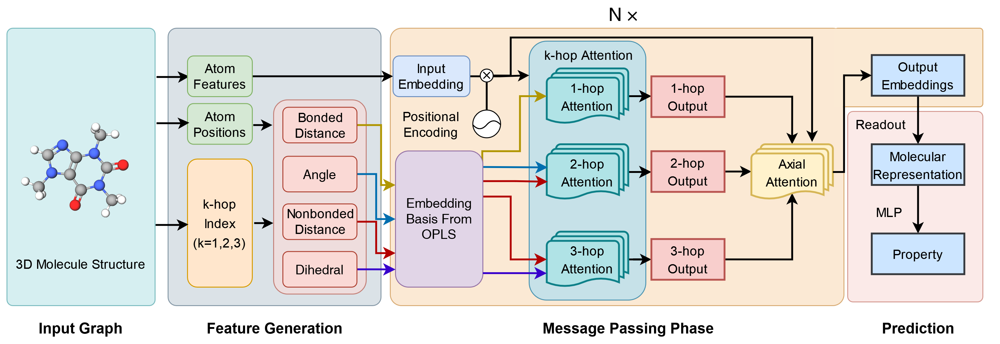

# Force field-inspired molecular representation learning for property prediction
This is the official implentation of FFiNet: "Force field-inspired molecular representation learning for property prediction". In this work,we construct a force field-inspired neural network (FFiNet) that can utilize all the interactions in molecules. Force field, which is a simple approximation to calculate the potential energy in molecules, divides all the interactions in molecules into four parts, i.e., bonded interactions, angle interactions, torsion interactions, and nonbonded interactions. Intuitively, these interactions can denote the importance of source atoms toward target atoms, which can be associated with graph attention mechanisms. Following this idea, we construct a novel attention-based message passing scheme that calculates the importance scores of source atoms within three hops according to their interactions with target atoms.



## Datasets
All the raw datasets except the QM9 and PDBBind dataset (which is very large) are lied in 'FFiNet/data/raw_files/'. The QM9 dataset can be download [here](https://deepchemdata.s3-us-west-1.amazonaws.com/datasets/molnet_publish/qm9.zip). The PDBBind dataset can be download [here](http://pdbbind-cn.org/) and they should be moved into 'FFiNet/data/raw_files/', the file structure for PDBBind should be:
```
raw_files
  | 
  └─PDBBind
  |  |
  |  └─core-set
  |  |  |
  |  |  └─1a30
  |  |  | ...
  |  └─refined-set
  |  |
  |  └─ INDEX_general_PL_data.2016    
```


## How to run
- Clone the source code of FFiNet \
```git clone https://github.com/fate1997/FFiNet```
- Install required packages \
```pip install -r requirements```
- Following the code in 'run_MoleculeNet.ipynb' and 'run_PDBBind.ipynb'
  - 'run_MoleculeNet.ipynb' - For the BACE, BBBP, ESOL, Lipophilicity, FreeSolv, and QM9 datasets
  - 'run_PDBBind.ipynb' - For the PDBBind dataset


## Cite
If you use FFiNet in your research, please cite:
```
@Article{Ren2023,
author={Ren, Gao-Peng
and Yin, Yi-Jian
and Wu, Ke-Jun
and He, Yuchen},
title={Force field-inspired molecular representation learning for property prediction},
journal={Journal of Cheminformatics},
year={2023},
month={Feb},
day={06},
volume={15},
number={1},
pages={17},
issn={1758-2946},
doi={10.1186/s13321-023-00691-2},
url={https://doi.org/10.1186/s13321-023-00691-2}
}
```

